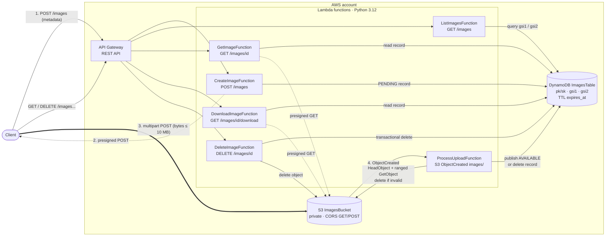

# Image Service

Service layer for image upload and storage in an Instagram style app. Built on API Gateway, Lambda (Python 3.12), S3 and DynamoDB. Runs fully on LocalStack for local development and deploys to AWS with the same template.

## Architecture



Plain text view:

```
client ──POST /images──▶ API Gateway ─▶ create_image ─▶ DynamoDB (PENDING record)
   │                                         └─▶ presigned POST returned
   └──multipart POST (bytes)──▶ S3 ──ObjectCreated──▶ process_upload
                                                        ├─ size and file signature ok ─▶ AVAILABLE (+ indexes, tag copies)
                                                        └─ otherwise ─▶ object and record deleted
client ──GET/DELETE /images...──▶ API Gateway ─▶ list / get / download / delete Lambdas
```

Why this shape:

* Image bytes go straight to S3. Lambda never buffers them, so the API Gateway (10 MB) and Lambda (6 MB) payload limits do not apply and the service scales with S3.
* Every Lambda is stateless and DynamoDB runs on demand, so concurrent users scale horizontally with no shared locks or counters.
* Every list filter maps to DynamoDB key queries. No table scans. Public and private images live in separate partitions, so a query only reads what the caller may see.
* S3 enforces size and content type through the presigned POST policy. The processor checks again, including the real file signature, so a renamed PDF never becomes visible.
* Code is layered: `handlers` (event in, response out) → `service` (access rules, upload verification) → `repository` (DynamoDB) and `storage` (S3). See [docs/SPEC.md](docs/SPEC.md) section 3.1.

## API reference

Base URL: the `ApiUrl` stack output on AWS, or `http://localhost.localstack.cloud:4566/restapis/<ApiId>/Prod/_user_request_` on LocalStack.

### Authentication

The caller id must match `^[A-Za-z0-9_-]{1,64}$`. It comes from the API Gateway authorizer context: `claims.sub` (Cognito user pool authorizer) or `principalId` (Lambda authorizer). When an authorizer has set it, `X-User-Id` is ignored, because authorizers pass client headers through untouched.

On LocalStack (`TrustUserHeader=true`, set by the `local` profile) send `X-User-Id: <id>` instead. The parameter defaults to `false`, so a prod stack without an authorizer answers every request with `401`. Attaching the authorizer itself is out of scope here.

### Errors

```json
{"error": {"code": "validation_error", "message": "limit must be between 1 and 100"}}
```

| Status | code | When |
|---|---|---|
| 400 | `validation_error`, `invalid_json` | Bad body, field, query parameter or `next_token`. Unknown fields are rejected. |
| 401 | `unauthorized` | No valid caller identity (authorizer context, or `X-User-Id` when trusted). |
| 403 | `forbidden` | Deleting another user's public image. |
| 404 | `not_found` | Image missing, still uploading, or private to another user. |
| 500 | `internal_error` | Unexpected failure. Details are only in CloudWatch logs. |

### Image object

```json
{
  "image_id": "3f2b8c1e-8d1a-4c5e-9f00-0a1b2c3d4e5f",
  "owner_id": "alice",
  "title": "Beach Sunset",
  "description": "Goa, 2026",
  "tags": ["beach", "sunset"],
  "visibility": "public",
  "content_type": "image/jpeg",
  "size_bytes": 482113,
  "created_at": "2026-10-03T10:00:00.000000Z"
}
```

### POST /images: start an upload

Body:

| Field | Type | Rules |
|---|---|---|
| `title` | string | Required. 1 to 100 characters after trimming. |
| `content_type` | string | Required. `image/jpeg`, `image/png`, `image/webp` or `image/gif`. |
| `description` | string | Optional. Up to 1000 characters. |
| `tags` | string[] | Optional. Up to 10. Each 1 to 32 of `a-z 0-9 _ -`. Lowercased and deduplicated. |
| `visibility` | string | Optional. `public` (default) or `private`. |

Response `201`, header `Location: /images/<image_id>`:

```json
{
  "image_id": "3f2b8c1e-8d1a-4c5e-9f00-0a1b2c3d4e5f",
  "status": "PENDING",
  "upload": {"url": "https://<bucket>.s3.amazonaws.com/", "fields": {"key": "images/alice/3f2b...", "Content-Type": "image/jpeg", "policy": "...", "x-amz-signature": "..."}, "expires_in": 300}
}
```

Then send the file as `multipart/form-data` to `upload.url`, with every entry of `upload.fields` as a form field and the file last, in a field named `file`. S3 answers `204`. Files over 10 MB or with another content type are refused. Within a few seconds the image becomes visible. Poll `GET /images/{image_id}`: the owner sees `"status": "PENDING"` until the file is verified, then `AVAILABLE`; a `404` means the file was rejected. Records whose upload never arrives are removed by DynamoDB TTL, 24 hours after creation at the earliest (TTL deletion can lag by up to about 48 hours).

```bash
curl -s -X POST "$API/images" -H "X-User-Id: alice" -H "Content-Type: application/json" \
  -d '{"title": "Beach Sunset", "tags": ["beach"], "content_type": "image/jpeg"}' > created.json
python3 - <<'EOF'
import json, subprocess
c = json.load(open("created.json"))["upload"]
args = ["curl", "-s", "-o", "/dev/null", "-w", "%{http_code}\n", c["url"]]
for k, v in c["fields"].items():
    args += ["-F", f"{k}={v}"]
subprocess.run(args + ["-F", "file=@sunset.jpg"], check=True)
EOF
```

### GET /images: list and search

All parameters are optional and can be combined.

| Parameter | Meaning |
|---|---|
| `user_id` | Images owned by this user. Includes private ones only when it is the caller. |
| `tag` | Images carrying this tag (case insensitive). |
| `created_from`, `created_to` | ISO 8601 date or datetime, inclusive. A bare date in `created_to` covers the whole day. No offset means UTC. Send `+` as `%2B`. |
| `title` | Case insensitive substring of the title. |
| `visibility` | `public` or `private`. `private` alone lists the caller's own private images. |
| `limit` | Page size, 1 to 100, default 20. |
| `next_token` | Value from the previous page. Only valid with the same filters. |

Without `user_id`, `tag` or `visibility=private` the result is the public feed. Results are newest first.

Response `200`:

```json
{"items": [{"image_id": "...", "title": "Beach Sunset", "...": "..."}], "next_token": "eyJwayI6..."}
```

`next_token` is `null` on the last page. It is a position (the last image returned), not tied to the filters: reusing it with other filters continues below that position. `title` and the `user_id` within `tag` filter run after the key lookup; the service queries again until the page is full, up to 5 rounds per request. A very selective filter can therefore still return a short or empty page with a `next_token`. Keep paging until it is `null`.

```bash
curl -s "$API/images?tag=beach&created_from=2026-10-01&limit=10" -H "X-User-Id: bob"
```

### GET /images/{image_id}: view

Response `200`: the image object plus `status` (`AVAILABLE`), `view_url` (presigned S3 URL that displays inline), `download_url` (presigned S3 URL that downloads as `<image_id>.<ext>`) and `url_expires_in` (seconds, 300). Browser clients use `download_url`, because a plain link cannot send the identity header.

The owner also gets `200` for their own image while it is still uploading: the image object with `"status": "PENDING"` and no URLs. Everyone else gets `404` until it is `AVAILABLE`.

### GET /images/{image_id}/download: download

Response `302` with `Location` set to the same kind of URL as `download_url`. Meant for `curl -L` and other clients that can send headers.

### CORS

The API, its default error responses and the S3 bucket allow the origin set by the `AllowedOrigin` template parameter. It is `*` on LocalStack. Prod deploys require an explicit origin (see Deploying to AWS). Allowed request headers: `Content-Type`, `X-User-Id`.

### DELETE /images/{image_id}

Owner only. Removes metadata, tag entries and the S3 object. Response `204` with an empty body. Pending uploads can be deleted too. If the S3 delete fails after the record is gone, the image is already invisible; the response is still `204` and the key is logged as `Orphaned S3 object after delete` for cleanup.

## Local development

Requirements: Docker with Compose, Python 3.12, make, and a free LocalStack account token.

```bash
export LOCALSTACK_AUTH_TOKEN=<your token>                    # never commit it
```

```bash
make install          # venv with pytest, moto, requests, SAM CLI and samlocal
make test             # unit tests with a 90% coverage gate (moto, no Docker needed)
make up               # start LocalStack on 127.0.0.1:4566
make deploy           # samlocal build + deploy (ENV=local is the default)
make smoke            # end to end run of every endpoint against LocalStack
make down
```

Find the API id:

```bash
AWS_ACCESS_KEY_ID=test AWS_SECRET_ACCESS_KEY=test samlocal list stack-outputs --stack-name image-service-local --region us-east-1
export API="http://localhost.localstack.cloud:4566/restapis/<ApiId>/Prod/_user_request_"
```

## Deploying to AWS

Profiles live in `samconfig.toml`: `local` (LocalStack) and `prod` (AWS, region `us-east-1`, change it there if needed).

```bash
AWS_PROFILE=<your profile> ALLOWED_ORIGIN=https://app.example.com make deploy ENV=prod
```

`prod` asks for change set confirmation and refuses to deploy without an explicit `ALLOWED_ORIGIN` (`*` is rejected). `PublicS3Endpoint` stays empty on AWS so presigned URLs use the normal S3 endpoint; that also turns on the TLS only bucket policy, point in time recovery and deletion protection on the table. `TrustUserHeader` stays `false`: attach an authorizer (see Authentication).

Operations:

* Stage throttling: 500 requests per second, burst 1000.
* Upload events that still fail after Lambda's 2 retries go to an SQS queue (`OnFailure` destination) for inspection and redrive. Redriving is safe: processing is idempotent, and an event whose record has expired deletes its object.
* Each function has an inline IAM policy limited to the actions it calls.

## Data model

One DynamoDB table, on demand capacity.

| Item | pk | sk | GSIs |
|---|---|---|---|
| Image | `IMG#<id>` | `META` | `gsi1` `USER#<owner>#<visibility>` / `<created_at>#<id>`; `gsi2` `PUBLIC` / `<created_at>#<id>` (public only). Both set only once the upload is verified. |
| Tag entry | `TAG#<tag>` (public) or `TAG#<tag>#<owner>` (private) | `<created_at>#<id>` | none. A copy of the image record, one per tag. |

A list request picks the partitions the caller may read (for example `USER#alice#public` and `USER#alice#private` when Alice lists her own images, only the first when Bob does), queries each newest first and merges them.

## Known limits and next steps

* No authorizer is wired in. Prod rejects every request until one is attached (Cognito or Lambda authorizer).
* Not tuned for AWS scale yet (local performance only for now): x86 at 256 MB, REST API rather than HTTP API, no CloudFront in front of downloads, no reserved concurrency, no API access logs.
* The public feed is one partition (`PUBLIC`). Shard it (`PUBLIC#0..N`) if writes approach 1000 per second. Very popular tags have the same ceiling.
* Title search is a substring filter applied after the key query. Move to OpenSearch if search becomes a main feature.
* Metadata cannot be edited after upload.
* While its presigned POST is still valid (300 s), the owner can upload a different valid image over an approved one. The processor rechecks the file signature, so junk is removed, but a valid swap goes through and `size_bytes` keeps the first value.
* No thumbnails or image resizing.
