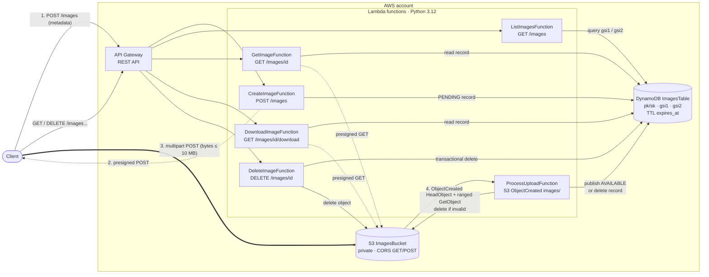

# Image Service Specification

Status: implemented. Source of truth for behavior is the code in `src/image_service/`. The README holds the API reference and usage instructions; this document holds requirements, design and the reasoning behind it.

## 1. Problem

Service layer for an Instagram style app. Users upload images with metadata, list and search them, view or download them, and delete them. Metadata lives in a NoSQL store. Many users use the service at once, so it must scale horizontally.

Mandated stack: API Gateway, Lambda (Python 3.7+), S3, DynamoDB. LocalStack for local development.

## 2. Requirements

### 2.1 Functional

| ID | Requirement | Source |
|---|---|---|
| F1 | Upload an image with metadata (title, description, tags, visibility). | Assignment task 1.1 |
| F2 | List all images with at least two search filters. | Assignment task 1.2 |
| F3 | View and download an image. | Assignment task 1.3 |
| F4 | Delete an image. | Assignment task 1.4 |
| F5 | Unit tests covering all scenarios. | Assignment task 2 |
| F6 | API documentation and usage instructions. | Assignment task 3 |
| F7 | Local environment on LocalStack. | Assignment, Development Environment |

### 2.2 Non functional

| ID | Requirement | How it is met |
|---|---|---|
| N1 | Scales with concurrent users. | Stateless Lambdas, on demand DynamoDB, bytes go straight to S3. |
| N2 | No table scans on any read path. | Every list query is a key query on the table or a GSI. |
| N3 | Only verified images are visible. | Two phase upload; processor checks size and file signature. |
| N4 | Private images never leak to other users. | Ownership checks on every read; 404 instead of 403 for others' private images; list queries never read partitions holding others' private images. |
| N5 | Same template deploys locally and to AWS. | SAM with `local` and `prod` profiles in `samconfig.toml`. |

### 2.3 Out of scope

Real authentication (an authorizer is assumed in front), metadata editing, thumbnails and resizing, full text search, likes, comments, feeds by follow graph.

## 3. Architecture



Plain text view:

```
client ──POST /images──▶ API Gateway ─▶ create_image ─▶ DynamoDB (PENDING record)
   │                                         └─▶ presigned POST returned
   └──multipart POST (bytes)──▶ S3 ──ObjectCreated──▶ process_upload
                                                        ├─ size and signature ok ─▶ AVAILABLE (+ GSI keys, tag copies)
                                                        └─ otherwise ─▶ object and record deleted
client ──GET/DELETE /images...──▶ API Gateway ─▶ list / get / download / delete Lambdas
```

### 3.1 Components

| Module | Responsibility |
|---|---|
| `handlers.py` | One Lambda entry point per route plus the S3 processor. Orchestration and authorization rules only. |
| `http.py` | API Gateway proxy parsing, caller identity, JSON responses, `ApiError` to HTTP mapping, CORS header. |
| `validation.py` | All client input parsing. Returns frozen dataclasses (`NewImage`, `ListQuery`). File signature sniffing. |
| `repository.py` | DynamoDB single table access. Atomic publish and delete with `TransactWriteItems`. |
| `storage.py` | S3 presigned POST and GET, upload inspection, object deletion. |
| `config.py` | Limits and environment lookups. |

Dependency direction: handlers → (http, validation, repository, storage) → config. Domain rules do not import boto3; adapters do.

### 3.2 Lambda functions

| Function | Trigger | IAM |
|---|---|---|
| CreateImageFunction | `POST /images` | DynamoDB CRUD, S3 write |
| ListImagesFunction | `GET /images` | DynamoDB read |
| GetImageFunction | `GET /images/{image_id}` | DynamoDB read, S3 read |
| DownloadImageFunction | `GET /images/{image_id}/download` | DynamoDB read, S3 read |
| DeleteImageFunction | `DELETE /images/{image_id}` | DynamoDB CRUD, S3 CRUD |
| ProcessUploadFunction | S3 `ObjectCreated:*` on prefix `images/` | DynamoDB CRUD, S3 CRUD |

Runtime Python 3.12, 256 MB, 10 s timeout. boto3 clients are built once per container, in the init phase, with 2 s connect and 5 s read timeouts and standard mode retries (3 attempts). Each function has an inline IAM policy with only the actions it calls. The processor sends events that still fail after 2 retries to an SQS `OnFailure` queue.

## 4. Upload lifecycle

### 4.1 States

```
          create_image                 process_upload (valid)
 (none) ───────────────▶ PENDING ─────────────────────────────▶ AVAILABLE
                            │  process_upload (invalid)              │
                            ├──────────────────────────▶ deleted     │ DELETE by owner
                            │  TTL 24 h, no upload                   ▼
                            ├──────────────────────────▶ deleted   deleted
                            │  DELETE by owner
                            └──────────────────────────▶ deleted
```

### 4.2 Sequence

1. Client calls `POST /images` with metadata and `content_type`.
2. Service validates input, writes a `PENDING` record with `expires_at = now + 24h`, and returns a presigned POST bound to key `images/<owner>/<image_id>`, the declared content type and a 1 byte to 10 MB length range. URL valid for 300 s.
3. Client posts the file directly to S3. S3 enforces the policy.
4. S3 emits `ObjectCreated`. `process_upload`:
   - Deletes the object if no record matches the key (stray or forged upload).
   - Reads the first 12 bytes and the total size (from `Content-Range`) in one ranged `GetObject`. An empty object counts as size 0.
   - If size exceeds the limit or the signature does not match the declared type, deletes record and object.
   - Otherwise, if still `PENDING`, publishes atomically: sets status, size, GSI keys, removes `expires_at`, and puts one tag copy per tag. The condition `status = PENDING` makes duplicate events no-ops.
   - A cancelled transaction while the record is still `PENDING` (conflict or throttle) re-raises so Lambda retries the event.
5. Records whose upload never arrives are removed by DynamoDB TTL. TTL deletion is best effort and can lag `expires_at` by up to about 48 hours; LocalStack does not reap by default.

Why two phase: image bytes never pass through API Gateway (10 MB) or Lambda (6 MB) payload limits, Lambda never pays for transfer time, and S3 absorbs upload concurrency.

## 5. Data model

Single DynamoDB table, on demand.

| Item | pk | sk | gsi1 (owner) | gsi2 (public feed) |
|---|---|---|---|---|
| Image | `IMG#<id>` | `META` | `USER#<owner>#<visibility>` / `<created_at>#<id>` | `PUBLIC` / `<created_at>#<id>` (public only) |
| Tag copy, public | `TAG#<tag>` | `<created_at>#<id>` | none | none |
| Tag copy, private | `TAG#<tag>#<owner>` | `<created_at>#<id>` | none | none |

Attributes on the image record: `image_id`, `owner_id`, `title`, `title_lower`, `description`, `tags`, `visibility`, `content_type`, `s3_key`, `status`, `created_at`, `size_bytes` (after publish), `expires_at` (while pending).

GSI keys are written only on publish, so pending images never appear in owner or public listings. Tag copies are full record copies so a tag query needs no second read. Public and private images never share a partition, and each private partition has one owner.

### 5.1 Access patterns

| Pattern | Operation |
|---|---|
| Get image by id | `GetItem IMG#<id> / META` |
| List by tag | `Query TAG#<tag>`, plus `TAG#<tag>#<caller>` for the caller's own private ones |
| List by owner | `Query gsi1 USER#<owner>#public`, plus `#private` when the owner is the caller |
| Public feed | `Query gsi2 PUBLIC` |
| Title substring, owner within tag | `FilterExpression` on those queries |

All queries use `sort key BETWEEN created_from AND min(created_to, cursor)`, newest first.

### 5.2 List algorithm

1. Choose the partitions (above). Only partitions whose items the caller may see are ever read.
2. Query each with `Limit = limit`. Collect the items and, for partitions that have more, their `LastEvaluatedKey` sort value.
3. The frontier is the highest of those sort values. Every partition has been read down to it, so items at or above it are complete and can be emitted in merged order.
4. If the page is full, the cursor is the last emitted item's sort key. If every partition is exhausted, there is no cursor. Otherwise query again below the frontier, up to `MAX_QUERY_ROUNDS` (5) rounds, then return the frontier as the cursor.
5. `next_token` is the base64url of the cursor (`<created_at>#<image_id>`), validated against a strict pattern. It is a position, not tied to a query, so reusing it with other filters is safe, and a cursor below `created_from` returns an empty page instead of an error.

## 6. API contract

Full reference with examples: README "API reference". Summary:

| Method | Path | Success | Errors |
|---|---|---|---|
| POST | `/images` | 201 + presigned POST, `Location` header | 400, 401 |
| GET | `/images` | 200 `{items, next_token}` | 400, 401 |
| GET | `/images/{image_id}` | 200 metadata + `status` + `view_url`, `download_url`; owner gets `PENDING` without URLs | 401, 404 |
| GET | `/images/{image_id}/download` | 302 to presigned GET | 401, 404 |
| DELETE | `/images/{image_id}` | 204 | 401, 403, 404 |

List filters: `user_id`, `tag`, `created_from`, `created_to`, `title`, `visibility`, plus `limit` (1 to 100) and opaque `next_token`. Five search filters against the required two.

Error body: `{"error": {"code": "...", "message": "..."}}`. Unexpected failures return a generic 500; details go only to CloudWatch.

## 7. Security

| Concern | Control |
|---|---|
| Identity | Caller id from `requestContext.authorizer` (`claims.sub` or `principalId`), pattern `^[A-Za-z0-9_-]{1,64}$`. The `X-User-Id` header is read only when `TRUST_USER_HEADER=true` (LocalStack profile) and never when an authorizer set an identity, since proxy integrations pass client headers through. Default is `false`: without an authorizer prod fails closed with 401. Wiring the authorizer is out of scope. |
| Authorization | Read: owner, or public and `AVAILABLE`. Delete: owner only. Others' private or pending images return 404 so ids cannot be probed. |
| Listing | Partition choice excludes others' private images before any read, so neither `items` nor `next_token` can reveal them. `next_token` is a strictly validated sort key position. |
| Upload | Presigned POST pins key, content type and size range; 300 s expiry. Processor re-checks size and magic bytes; declared type is never trusted. SVG and HTML are not accepted types. |
| Download | Presigned GET, 300 s. Download URL forces `Content-Disposition: attachment` with a server generated filename (`<uuid>.<ext>`). |
| Bucket | All public access blocked. Objects reachable only through presigned URLs. On AWS a bucket policy denies non TLS requests. |
| Input | Unknown body fields and query parameters rejected. Length limits on every string. Tags constrained to `[a-z0-9_-]{1,32}`, at most 10. |
| CORS | Single configured origin (`AllowedOrigin`), required and not `*` for prod deploys. Applied to Lambda responses, gateway error responses and the bucket. |
| Abuse | Stage throttling 500 rps, burst 1000. |
| Data | On AWS: DynamoDB point in time recovery and deletion protection. |
| Errors | No stack traces or internal messages in responses. |
| Least privilege | Inline per function statements: create `PutItem` + `s3:PutObject`; list `Query`; get and download `GetItem` + `s3:GetObject`; delete `GetItem`, `DeleteItem` + `s3:DeleteObject`; processor `GetItem`, `UpdateItem`, `PutItem`, `DeleteItem` + `s3:GetObject`, `s3:DeleteObject`, `s3:ListBucket`. |

## 8. Scalability and performance

* Lambda scales per request; no shared state, locks or counters.
* DynamoDB on demand; partitions keyed by image, owner and tag spread load.
* Known hot partitions: `PUBLIC` feed and very popular tags (about 1000 writes/s per partition). Mitigation: shard keys `PUBLIC#0..N`; the list merge in 5.2 already reads multiple partitions, so shards would be extra partitions.
* Upload and download bandwidth handled entirely by S3.
* Filtered lists repeat queries server side to fill a page (up to 5 rounds), so short pages only happen with very selective filters.
* Performance work is scoped to the code running on LocalStack for now: client timeouts and retries, clients built in the init phase, one S3 call per processed upload, page filling. AWS sizing (arm64, memory, HTTP API, CloudFront, reserved concurrency) is deferred.

## 9. Testing

| Layer | Tooling | Scope |
|---|---|---|
| Unit | pytest + moto (S3, DynamoDB), 90% coverage gate | Validation, HTTP helpers, every handler, processor edge cases (stray key, oversize, wrong signature, duplicate event, missing object, lost race), list filters and pagination, authorization matrix. |
| End to end | `scripts/smoke.py` against LocalStack | 401, create, owner sees PENDING, real upload, processor publish, list by tag, user, title, date range and paging, private image isolation, signature rejection, get, download redirect, CORS, delete with S3 and tag copy checks, oversize. |

Commands: `make test`, `make up`, `make deploy`, `make smoke`.

## 10. Requirements traceability

| ID | Status | Evidence |
|---|---|---|
| F1 | Done | `POST /images` + presigned POST + `process_upload`; `tests/test_create_image.py`, `tests/test_process_upload.py` |
| F2 | Done (5 filters) | `GET /images`; `tests/test_list_images.py` |
| F3 | Done | `GET /images/{id}`, `GET /images/{id}/download`; `tests/test_get_and_download.py` |
| F4 | Done | `DELETE /images/{id}`; `tests/test_delete_image.py` |
| F5 | Done | 78 unit test functions across 7 files (more cases via parametrize), coverage gate 90% |
| F6 | Done | README API reference, curl examples, local and AWS instructions |
| F7 | Done | `docker-compose.yml`, `samconfig.toml` `local` profile, `make deploy` via samlocal |

## 11. Known limits

* No authorizer in this scope; prod fails closed until one is attached.
* Single partition public feed and per tag partitions cap write throughput per partition.
* Title search is a post filter, not an index.
* Metadata is immutable after upload.
* Within the 300 s presigned window the owner can overwrite an approved image with another valid image; `size_bytes` keeps the first value.
* No thumbnails or resizing.

## 12. Review findings (2026-10-03)

Four read-only reviews were run: architecture, end-to-end flow, security and performance. Duplicates are merged below. Items already listed in section 11 are not repeated. Status after the fix pass on 2026-10-03 is in the Status column. Performance work was limited to local systems on request.

Verdict: the architecture is sound for the problem. The two-phase direct-to-S3 upload, the conditional transactional publish and the key-only queries all hold up. The remaining gaps are operational hardening, not design flaws.

### 12.1 Correctness and security bugs

| ID | Severity | Location | Finding | Fix | Status |
|---|---|---|---|---|---|
| R1 | Medium | `repository.py` `list_images`, `handlers.py` `list_images` | `next_token` is the raw `LastEvaluatedKey`. That is the last item *read*, before the filter runs, so it can be another user's private image. Example: `?user_id=victim&limit=1` while paging leaks private image ids, `created_at` values and the count, and `?tag=x&user_id=victim` leaks which tags they use. | Build the token from the last *returned* item, or HMAC or encrypt the token. | Fixed: visibility split partitions, sort key cursor |
| R2 | Medium | `repository.py` `list_images` | A token reused with different `created_from`/`created_to` values, or with a forged `sk`, falls outside the key condition. DynamoDB raises `ValidationException`, which comes back as 500 where 400 is documented. | Catch `ValidationException` and turn it into `InvalidStartKey`, or check that `start_key[sort_attr]` lies in `[low, high]`. | Fixed: cursor is a position; `low > high` returns empty |
| R3 | Low | `validation.py` `decode_next_token` | Empty or oversized string values pass validation and lead to a DynamoDB error, which comes back as 500. Verified. | Reject empty values and values longer than about 300 characters. | Fixed: strict cursor pattern |
| R4 | Low | `validation.py` `_timestamp` | `created_to=9999-12-31T23:59:59-23:00` raises `OverflowError`, which comes back as 500. Verified. | Catch `OverflowError` and return 400. | Fixed |
| R5 | Low | `Makefile` deploy | The prod guard accepts `ALLOWED_ORIGIN=*`. | Reject `*` when `ENV` is not `local`. | Fixed |

### 12.2 Operational gaps

| ID | Severity | Finding | Fix | Status |
|---|---|---|---|---|
| O1 | High (prod) | The trusted `X-User-Id` header lets anyone act as any user. Accepted for this scope, but the fix the README describes is incomplete (see section 7). | Add a Cognito or JWT authorizer, read the caller from `requestContext.authorizer`, and correct the README. | Fixed in code (authorizer context, header only when trusted, fails closed). Authorizer wiring deferred |
| O2 | High | `ProcessUploadFunction` has no DLQ or OnFailure destination, and the bucket has no lifecycle rule. After S3's async retries are spent, the event is lost: the record expires by TTL and the S3 object is orphaned for good. An S3 delete that fails in `delete_image` also orphans the object. | Add `EventInvokeConfig` with an OnFailure destination to SQS, plus an orphan sweep, or route S3 to SQS to Lambda. | Fixed: SQS OnFailure destination; delete logs orphans and returns 204. Scheduled orphan sweep deferred |
| O3 | Medium | There is no stage throttling, usage plan, WAF, reserved concurrency or per user pending cap. | Add `MethodSettings` throttling, reserved concurrency on the processor, and a cap on pending images per user. | Throttling added. Reserved concurrency (can fail on low limit accounts) and per user pending cap deferred |
| O4 | Medium | IAM is broader than needed: Crud, Write and Read templates where single actions would do. | Use inline statements: create `PutItem` + `s3:PutObject`; get/download `GetItem` + `s3:GetObject`; delete `GetItem`, `TransactWriteItems`, `DeleteItem` + `s3:DeleteObject`. | Fixed |
| O5 | Low | No TLS-only bucket policy, no PITR or deletion protection on the table, no `DeletionPolicy: Retain`, and no API access logs. | Add these for prod. | TLS policy, PITR, deletion protection added (AWS only). Access logs deferred (needs account level role) |
| O6 | Low | The owner gets 404 on their own PENDING image, so a client cannot tell "processing" apart from "rejected". | Return the `status` field to the owner. | Fixed |

### 12.3 Performance boosts

| ID | Impact | Cost | Change | Status |
|---|---|---|---|---|
| P1 | High | Cheap | Set a shared botocore `Config(connect_timeout=2, read_timeout=5, retries={"mode": "standard", "max_attempts": 3})`. The defaults (60 s timeouts) exceed the 10 s Lambda timeout. | Done |
| P2 | High | Cheap | Build the boto3 clients at module import, in the init phase, so the first request does not pay for it. | Done |
| P3 | High | Cheap | Add `Architectures: [arm64]` and `MemorySize: 512`, then confirm with Lambda Power Tuning. | Deferred (AWS only) |
| P4 | Medium | Cheap | In `inspect_upload`, replace the two calls with one ranged `GetObject` and parse the size from `ContentRange`. This also removes the HEAD/GET race. | Done |
| P5 | Medium | Cheap | Skip the redundant visibility filter on the `gsi2` path. | Done (filter removed) |
| P6 | Medium | Cheap | Narrow the GSI projection to `INCLUDE` and store fewer attributes in tag copies. This cuts write units per publish. Changing the projection recreates the GSI. | Deferred (AWS cost) |
| P7 | Medium | Structural | Loop the query server side until `limit` items are found or a read budget runs out, so filters stop returning short pages. | Done |
| P8 | Medium | Structural | Put visibility in the `gsi1` key (`USER#<id>#public`) so another user's profile view does not read private items. | Done (with R1) |
| P9 | Medium | Structural | Move to an HTTP API: about 70% cheaper, with lower latency and a native JWT authorizer (which also fixes O1). | Deferred (AWS only) |
| P10 | Medium | Structural | Serve public images from CloudFront with OAC for edge caching. | Deferred (AWS only) |
| P11 | High at scale | Structural | Write shard `PUBLIC#0..N` and hot tags. | Deferred (AWS scale) |

### 12.4 Test gaps

All closed by new tests. Unit tests: pagination on the tag and owner paths, a token reused with changed date bounds (R2), the conflict re-raise in `mark_available`, URL encoded S3 keys, and `/download` on a pending image.

Smoke tests: currently only the `tag` filter. Missing are `user_id`, date range, `title`, `visibility=private`, paging, another user reading a private image (404), a 401, a bad file signature, and checks after delete that the S3 object and tag copy are gone.
